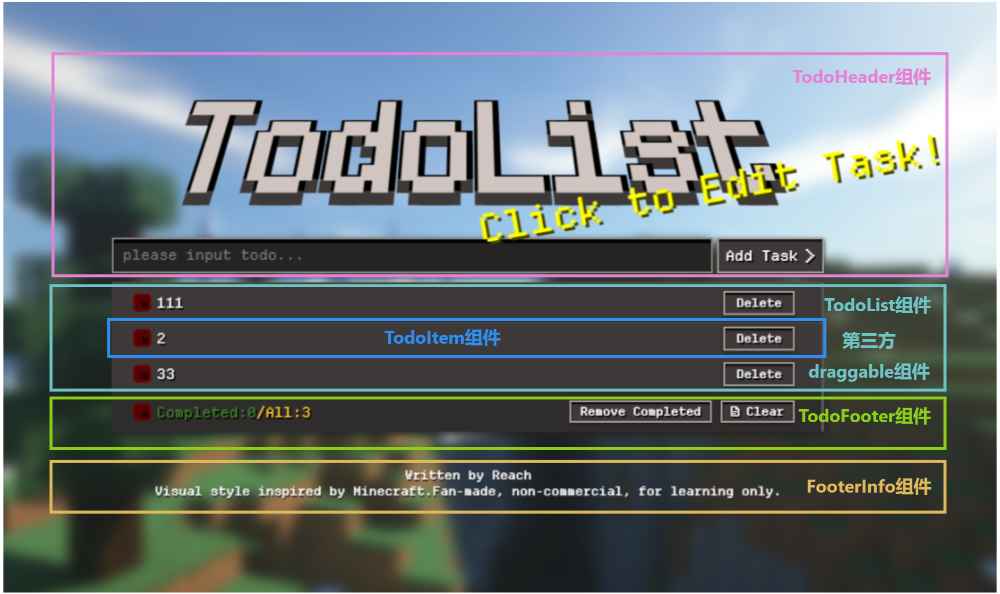
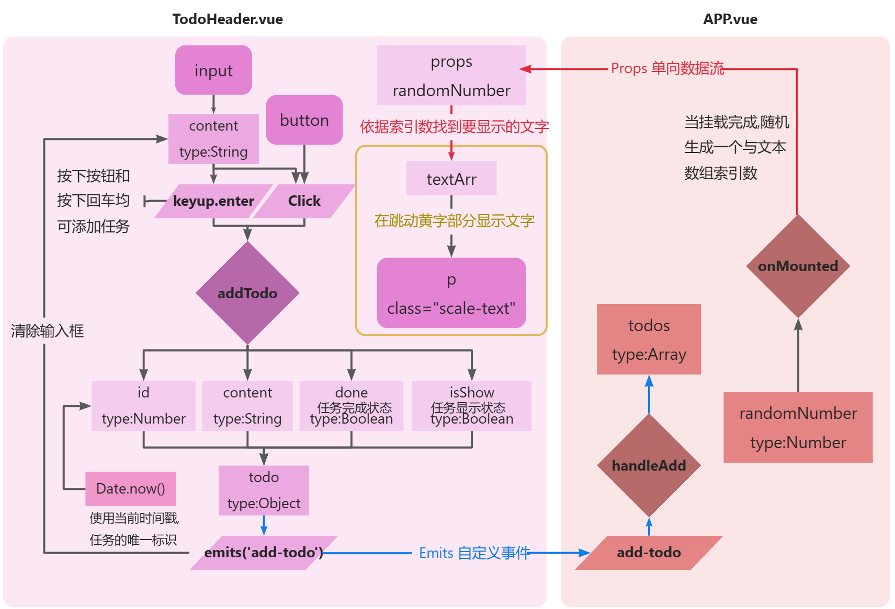
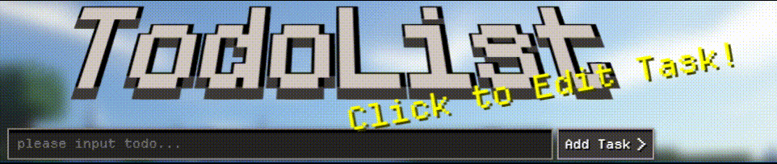
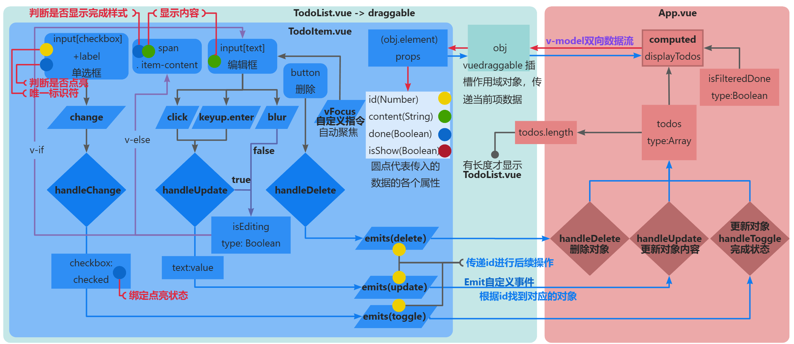
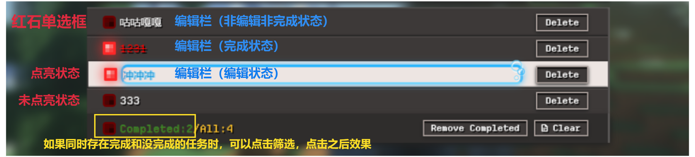
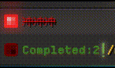
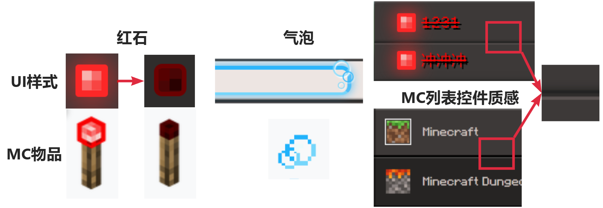

#  个人学习TodoList案例
基于Vue 3实现的我的世界风格待办事项应用

功能预览、试用（已经打包成静态文件并部署到线上）

[](https://reach1020.github.io/TodoList_Minecraft_Style/)[](https://github.com/reach1020/TodoList_Minecraft_Style)


## 1.功能分析

### 1.1组件拆分图



```html
<TodoHeader/>
<TodoList/>
	<draggable>
		<TodoItem/>
		<TodoItem/>
		...
<TodoFooter/>
<FooterInfo/>
```

### 1.2 功能需求

#### 1.2.1主体功能

##### (1) 添加功能

- 在文本框输入内容，按下添加按钮或者回车键添加待办任务
- 如果文本框中没有内容，则提示“内容为空”
- 添加完成之后，清空文本框内容

##### (2) 修改功能

- 点击checkbox单选框，在任务内容上显示中横线，表示已完成待办任务
- 双击任务内容，显示文本框， 并自动获得焦点，能够修改内容
- 修改完成后，文本框失去焦点或者按下回车，更新内容

##### (3) 删除/清除功能

- 点击按钮，删除单个任务
- 点击按钮，删除全部已完成任务
- 点击按钮，清除全部任务

##### (4) 统计功能

- 统计已完成任务数量和全面任务的数量

##### (5) 过滤功能

- 点击已完成任务标签，可以选择只显示已完成的任务

##### (6) 数据缓存

- 本地存储，刷新页面不丢失数据

##### (7) 拖拽排序

- 鼠标拖拽，自由调整待办列表顺序

## 2.技术分析

### 2.1技术栈

- 核心框架：Vue 3
- 样式实现：HTML5 + CSS3
- 交互增强：vuedraggable（拖拽排序）、自定义 Vue 指令 
- 数据存储：localStorage（本地持久化） 
- 脚本规范：JavaScript ES6+
- 工程化工具：Vite  (项目构建 / 打包 / 热更新)
- 版本管理：Git
- 运行环境：Node.js  + pnpm (依赖安装、终端命令执行)

## 3.开发环境准备

### 3.1环境依赖要求

- Node.js：版本 >=20.19.0 (Vite v7.3.1最低版本要求) 开发使用版本：v24.14.0
- 包管理工具：pnpm v10.30.3  (npm亦可)
- 编辑器：VS Code v1.111.0
- 浏览器：Chrome/Edge
- 版本管理工具: GitHub v2.39.2

### 3.2 环境搭建步骤

#### 3.2.1 安装Node.js

前往Node官网下载对应系统最新稳定版，安装后打开终端，运行`node -v`、`npm -v`，能显示版本号即安装成功。

#### 3.2.2（选用npm可跳过）下载pnpm包。

pnpm是高性能npm，比前两者在性能上有很大提升，可以解决npm和yarn重复文件和复用率的问题。

```powershell
#终端输入全局安装
npm install -g pnpm
#能查到版本即安装成功
pnpm -v
```

#### 3.2.3 使用Vite快速构建

（1）安装Vite

```powershell
pnpm add -g vite  #以下均使用pnpm
vite -v 	#查看版本
```

（2）终端输入，设置项目名称->选择Vue架构->Official Vue Starter->跳过所有附加的功能和试验特性->跳过所有示例代码，选择是。

```powershell
pnpm create vite  #出现node_modules文件夹即成功
```

#### 3.2.4 安装依赖，并启动开发环境

使用VS Code打开刚刚生成的项目文件夹，打开终端，输入以下代码

```powershell
pnpm i   #安装所需的包(pnpm install的简写)
pnpm dev   #开启服务器
```

Ctrl+左键 进入控制台输出的地址（默认http://127.0.0.1:5173/）

## 4.项目目录结构

```
TodoList/
├── .vscode/                 # VS Code 编辑器配置（如工作区设置、插件推荐）
├── dist/                    # 生产构建产物目录（执行 build 后生成 !忽略）
├── docs/                    # 项目文档目录（用于部署静态网页至github）
├── node_modules/            # 项目依赖包（由 pnpm/npm 安装生成 !忽略）
├── public/                  # 静态资源目录（会被原封不动复制到 dist 根目录）
├── READMEImage/             # 存放 README.md 中用到的图片资源
├── src/                     # 源代码目录（!!核心开发目录）
│   ├── assets/              # 项目静态资源
│   │   ├── fonts/           # 字体文件
│   │   └── images/          # 图片文件
│   ├── components/          # 可复用 Vue 组件
│   │   ├── FooterInfo.vue   # 底部信息组件
│   │   ├── TodoFooter.vue   # Todo 列表底部组件
│   │   ├── TodoHeader.vue   # Todo 列表头部组件
│   │   ├── TodoItem.vue     # 单个 Todo 项组件
│   │   └── TodoList.vue     # Todo 列表容器组件
│   ├── App.vue              # 根组件（整个应用的入口组件）
│   └── main.js              # 应用入口文件（创建 Vue 实例、挂载到 DOM）
├── .gitignore               # Git 忽略文件配置（指定不提交的文件/目录）
├── index.html               # HTML 入口文件（Vite 会以此为模板构建）
├── package.json             # 项目配置文件（依赖管理、脚本命令等）
├── README.md                # 项目说明文档
└── vite.config.js           # Vite 配置文件（构建、插件、代理等配置）
```

## 5.业务逻辑

### 5.1 TodoHeader

#### 5.1.1 数据流程图



#### 5.1.2 风格介绍



##### (1) TodoList标题文字3D效果

**text-shadow**: *h-shadow v-shadow blur color*;

```css
/*组合使用可以实现文字3D效果*/
text-shadow:
  -4px -2px 0 #000,  /* 左上 */
  8px -2px 0 #000,	/* 右上 */
  -4px 15px 0 #3d3938,  /* 左下 */
  8px 15px 0 #3d3938;		/* 右上 */
	transform: rotateX(45deg)  /* 配合透视距离,能够绕3D的X轴旋转,呈现字体上大下小 */

/* 在父组件加入此样式:透视距离,与文字3D效果配合使用 */
  perspective: 900px;
```

##### (2) 复刻MC初始界面跳动黄字

根据挂载时，初始化生成的随机索引，获取文字数组内对应文字。

结合动画效果，对文字进行倾斜和缩放。

### 5.2 TodoList

#### 5.2.1数据流程图



#### 5.2.2 风格介绍





##### （1）红石单选框

**原生复选框改造 + CSS 伪元素 + 状态驱动样式**实现 “红石风格” 的自定义单选框（复选框）交互

1.**原生复选框样式隐藏**，将其opacity设置为0（元素只是透明，并没有消失）

2.**自定义基底样式与布局**，将checkbox的label设为相对定位的正方形容器，作为自定义复选框的视觉基底。设置位置使其与原生复选框重叠，保证点击区域。

3.**伪元素视觉层级构建**，将checkbox的label的其前后伪元素设为绝对定位的像素点，作为核心高亮点。以label作为中间基底，label的边框作为外层边框，形成三层视觉递进。

4.**交互状态与视觉反馈**，在点击时改变label及其前后伪元素的颜色，增加文字阴影text-shadow（水平垂直距离为0，只设置模糊距离）。【霓虹效果与呼吸灯效果(配合动画)均可以此实现】



##### （2）气泡编辑栏

1.三个尺寸递减的圆形容器，并将其设置为绝对定位，层级设定为最高，模拟气泡效果。

2.利用text-shadow属性为圆形容器内的字符添加白色偏移阴影，强化气泡的立体质感。

3.通过为编辑框设置四侧不同的边框颜色，还原气泡的自然光影与通透质感。

##### （3）组件间凹陷质感

为每个 TodoItem 设置**阴影色值递减 + 垂直偏移量递增**的 box-shadow，模拟自然的光影层级。多个组件共同组合形成凹陷质感。

```css
box-shadow:
  0 -1px 2px #2f2d2c,
  0 1px 0px #222,
  0 2px 0px #2f2d2c,
  0 3px 0px #5a5352;
```

